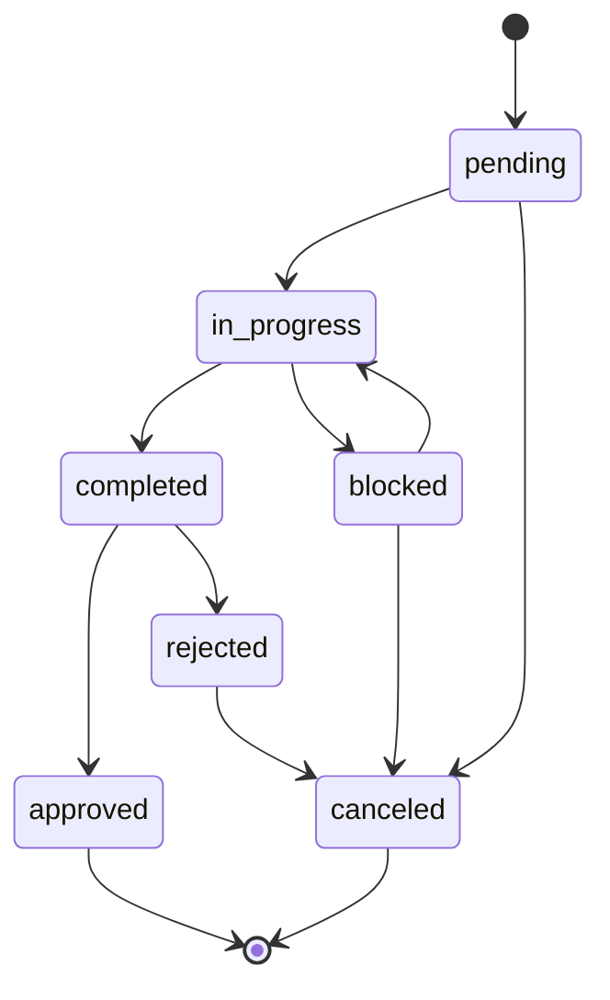
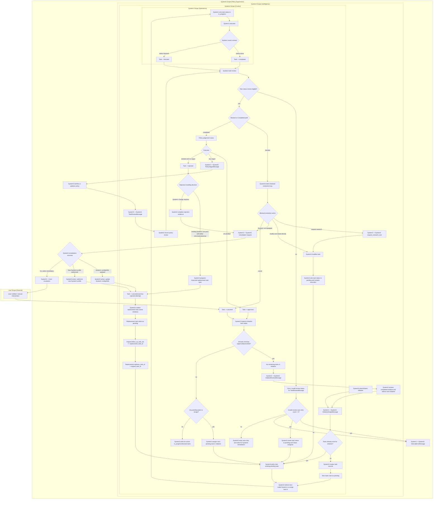
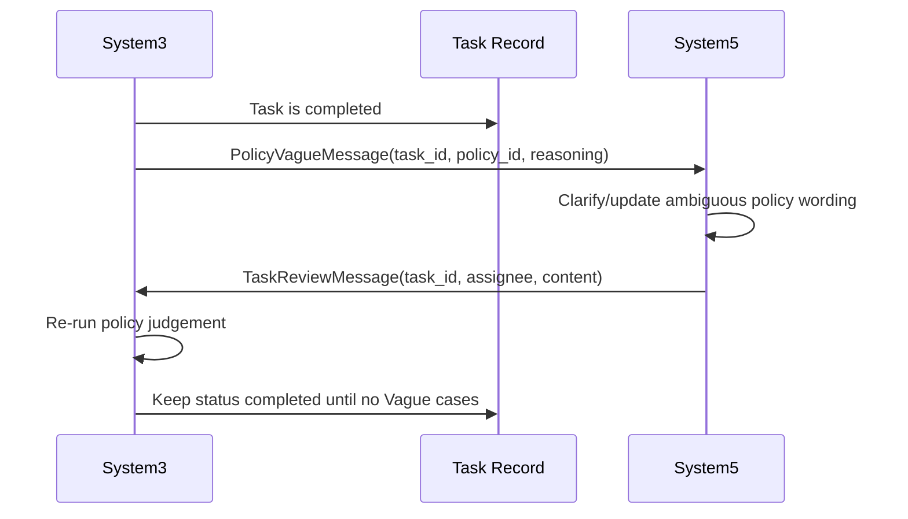

# Task Flows

## Overview
This document is the canonical discussion surface for the full task lifecycle:
- status transitions
- execution and review loops
- rejection handling and replacement-attempt lineage
- initiative progression and review gates

This document now reflects the intended target behavior for implementation.

## Lifecycle State Machine
Target transitions (single task record) are:
- `pending -> in_progress | canceled`
- `in_progress -> completed | blocked`
- `blocked -> in_progress | canceled`
- `completed -> approved | rejected`
- `rejected -> canceled`
- `approved` is terminal
- `canceled` is terminal

## End-To-End Runtime Flow

## Vague Clarification Loop (System3 <-> System5)
When review produces one or more `Vague` cases, the task stays `completed` while
System3 and System5 resolve policy ambiguity and retrigger review.

## Task Creation And Initial Assignment
- Task creation starts from an initiative assignment to System3.
- If no tasks exist for the initiative, System3 creates task records.
- Newly created tasks start in `pending`.
- System3 selects the next pending task, then selects the best-suited System1, then assigns.
- On assignment handling, System1 moves the task to `in_progress` before execution.
- After each `approved` or `canceled` outcome, System3 checks initiative task states:
  - if pending tasks exist, assign the next pending task
  - if no pending tasks but non-terminal tasks exist, wait
  - if all tasks are terminal (`approved|canceled`), send `InitiativeReviewMessage` to System4

## Status Semantics
- `pending`: backlog state for a defined task, ready for assignment.
- `in_progress`: task is actively being executed by System1.
- `blocked`: System1 could not complete task with current context/capability.
- `completed`: System1 returned done-result; waiting for/under policy review.
- `approved`: completed output satisfied policies; terminal success.
- `rejected`: completed output failed policy review; must be archived and replaced.
- `canceled`: terminal stop state for that specific task attempt.

## Review Contract
- Review-eligible statuses are `completed` and `blocked`.
- If a `TaskReviewMessage` is received for any other status:
  - System3 sends `InternalErrorMessage` to System5
  - System3 resets task to `pending` and reassigns (best System1 reselected)
  - auto-retry is capped at 3 attempts
  - after cap is reached, System3 keeps escalation-only behavior and does not auto-retry
- `completed` path:
  - all cases `Satisfied` -> `approved`
  - any case `Vague` -> remain `completed` and request clarification/review retry
  - no vague and at least one `Violated` -> `rejected`
- `blocked` path:
  - System3 executes blocked-resolution flow (research/modify/restart)
  - if blocked-resolution determines System1 is not equipped, System3 sends a remediation request to System5
  - result is either resumed execution (`pending` -> reassigned) or `canceled`

## Rejected Task Flow
After a task is `rejected`, handling is always replacement-based:
- original rejected task is moved to `canceled`
- a replacement task is created in the same initiative
- replacement starts as `pending`
- replacement does not inherit assignee; System3 always reselects best System1

Decision split before replacement assignment:
- existing System1 can pass with better information/prompt
- System1 change is required

If System1 change is required:
- System3 compiles structured rejection evidence (cases + execution traces)
- System3 sends remediation request to System5
- System5 may update System1 config/skills or authorize a new System1 profile
- only System5 escalates to user when no viable remediation exists

## Task Attempt Lineage
- Forward link on original task: `tasks.follow_up_task_ids` (JSON list of task IDs)
- Reverse link on replacement task: `tasks.replaces_task_id` (single task ID)
- Expected usage:
  - when a rejected task is replaced, append replacement id to original `follow_up_task_ids`
  - set replacement `replaces_task_id` to original task id
  - keep all attempts as immutable historical records

## Discussion Topics
Use this section to align remaining details before code changes:
- Exact message schemas/payloads for replacement creation and remediation outcomes (see `docs/technical/message_contracts.md`)
- Whether `NX5` should be purely passive wait or publish an explicit heartbeat/monitor event
