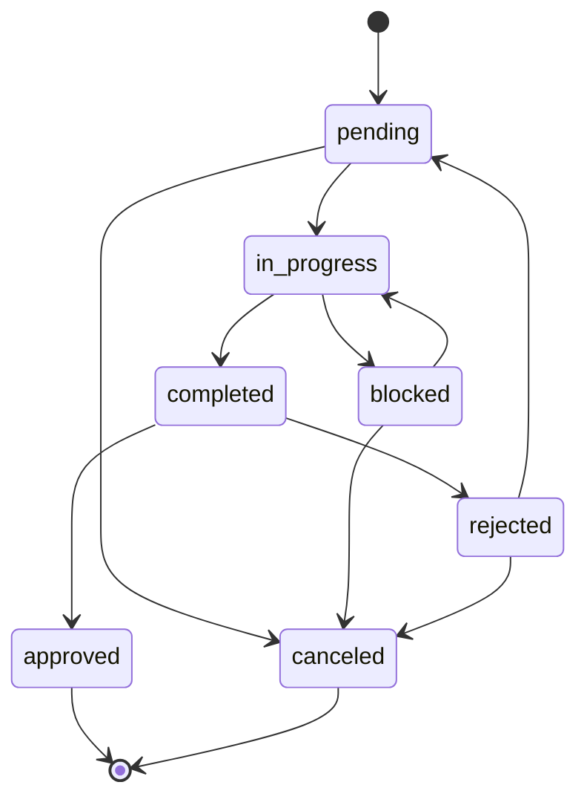
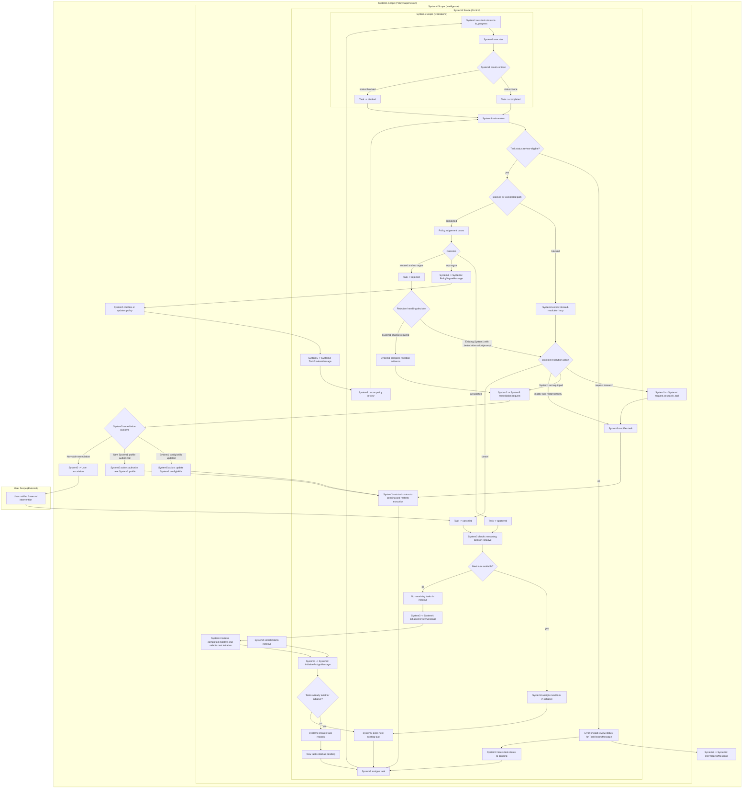
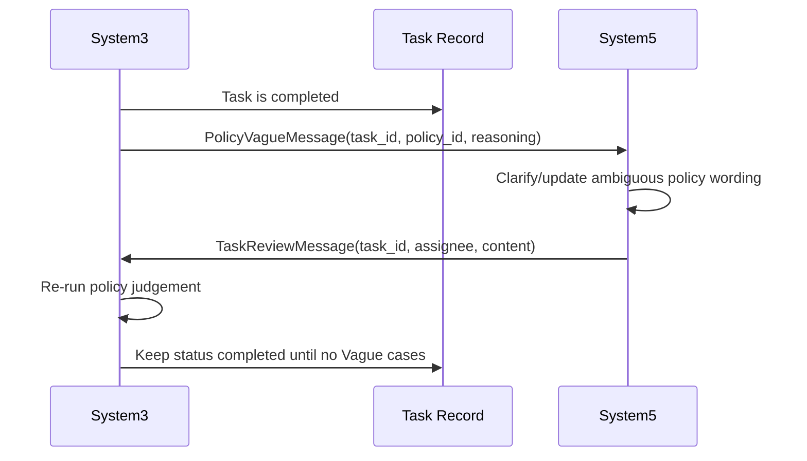

# Task Flows

## Overview
This document is the canonical discussion surface for the full task lifecycle:
- status transitions
- execution and review loops
- rejection handling and restart paths
- follow-up task linkage

It reflects the current implementation and highlights places where behavior can be evolved.

## Lifecycle State Machine
Current transitions (from `ALLOWED_TASK_TRANSITIONS`) are:
- `pending -> in_progress | canceled`
- `in_progress -> completed | blocked`
- `blocked -> in_progress | canceled`
- `completed -> approved | rejected`
- `rejected -> pending | canceled`
- `approved` is terminal
- `canceled` is terminal

## End-To-End Runtime Flow

## Vague Clarification Loop (System3 <-> System5)
When review produces one or more `Vague` cases, the task stays `completed` while
System3 and System5 resolve policy ambiguity and retrigger review.

## Task Creation And Initial Assignment
- Task creation starts from an initiative assignment to System3.
- If no tasks exist for the initiative, System3 creates task records.
- Newly created tasks start in `pending`.
- System3 selects the next task and assigns it to System1.
- On assignment handling, System1 moves the task to `in_progress` before execution.
- After each task ends in `approved` or `canceled`, System3 checks for remaining
  tasks in the same initiative and assigns the next one.
- If no tasks remain, System3 sends `InitiativeReviewMessage` to System4 for
  initiative review and next-initiative selection.

## Status Semantics
- `pending`: backlog state for an already-defined task, ready to be assigned.
- `in_progress`: task is actively being executed by System1.
- `blocked`: System1 could not complete task with current context/capability.
- `completed`: System1 returned done-result; waiting for/under review outcome.
- `approved`: completed output satisfied policies; terminal success.
- `rejected`: completed output failed policy review; requires rework or cancellation decision.
- `canceled`: terminal stop state when work should not continue on this task.

## Review Contract
- Review-eligible statuses are `completed` and `blocked`.
- If a `TaskReviewMessage` is received for any other status, System3 should
  treat it as an internal error, route it to System5, reset task status to
  `pending`, and continue with assignment.
- `completed` path:
  - all cases `Satisfied` -> `approved`
  - any case `Vague` -> remain `completed` and request clarification/review retry
  - no vague and at least one `Violated` -> `rejected`
- `blocked` path:
  - System3 executes blocked-resolution flow (research/modify/restart)
  - if blocked-resolution determines System1 is not equipped, System3 sends
    a remediation request to System5 and continues via `System5 remediation outcome`
  - task can return to `in_progress` or end as `canceled`

## Rejected Task Flow
After a task is `rejected`, handling should be:
- choose one of two paths:
  - existing System1 can solve it with improved information/prompt
  - System1 change is required (capability/config/profile remediation via System5)

If replacement work is created, the flow should:
- compile structured rejection evidence from case judgements and execution traces
- request System5 remediation before replacement assignment
  - System5 may update current System1 config/skills
  - or authorize a better-equipped System1 profile
- only System5 escalates to user when no viable remediation exists
- move the original task to `canceled`
- link replacement task IDs on the original via `follow_up_task_ids`
- route into the task-creation path (`System3 creates task records`)

## Follow-Up Task Linking
- Field: `tasks.follow_up_task_ids` (JSON list of integer task IDs)
- Purpose: lineage between original task and replacement/follow-up tasks
- Expected usage:
  - when a rejected task is replaced, append the new task ID(s) to the original
  - keep the original task as historical record (`rejected` or `canceled`)

## Discussion Topics
Use this section to align desired behavior before further code changes:
- Should System3 always create follow-up tasks on cancellation, or only for selected rejection scenarios?
- Should initiative progression depend on all tasks being terminal (`approved|canceled`)?
